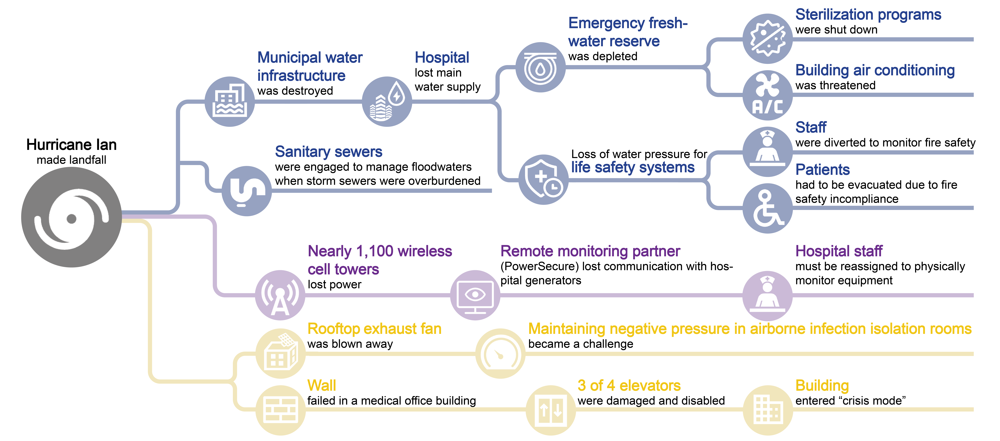
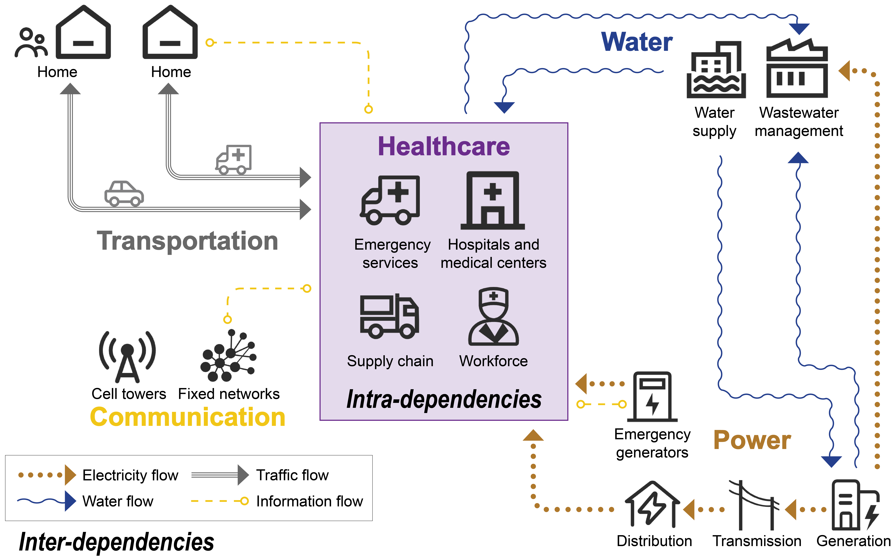

# Understanding vulnerability and identifying resilience strategies for the healthcare critical infrastructure (HCI) nexus

Extreme weather events intensified by climate change pose escalating risks to interconnected critical infrastructures, creating cascading consequences for healthcare systems and community well-being. Despite the growing concern about these risks, analytical frameworks that capture how the healthcare critical infrastructure (HCI) nexus functions as an integrated network and responds to climate-induced disruptions remain limited.

Fig. 1. Failure chains of the Lee Health hospital and interconnected CI networks during Hurricane Ian. Chain 1 (blue): Municipal water utility failure; Chain 2 (purple): communication infrastructure failure; Chain 3 (yellow): direct damage to physical infrastructure assets.

Fig. 2. Key components and dependencies within HCI nexus

To address this gap, we first develop a conceptual model of the HCI nexus, followed by a geospatial multi-layer network model to measure direct HCI exposure to coastal flooding and to evaluate cascading failures within the nexus, using Lee Health hospitals as a case study. To simulate time-evolving failure dynamics, we employ a Dynamic Bayesian Network (DBN) framework that captures conditional failure probabilities across infrastructure layers. Rather than replicating past events, this approach leverages empirical patterns to anticipate potential failure pathways under future flood scenarios. Building on these insights, we identify evidence-based resilience strategies to reduce systemic risks and ensure continuity of care for affected communities. This study advances understanding of the complex and interconnected HCI nexus and contributes to the broader body of knowledge that supports healthcare systems in preparing for and mitigating cascading disruptions caused by climate extremes.

This work will be presented at [AAG 2026](https://aag-meetings.secure-platform.com/aag2026/solicitations/93/sessiongallery/25117/application/45923).