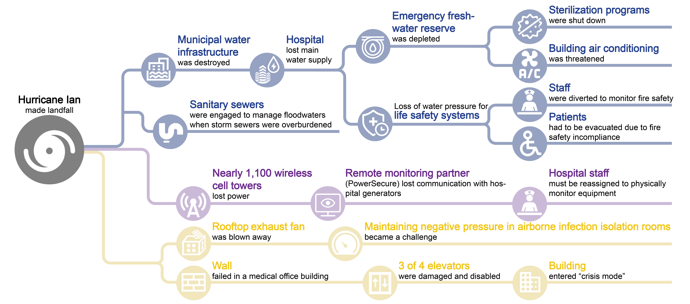

# Understanding vulnerability and identifying resilience strategies for the healthcare critical infrastructure (HCI) nexus

In recent years, large-scale disasters have repeatedly exposed the vulnerability of healthcare systems. In September 2022, Hurricanes Fiona and Ian struck Puerto Rico and Florida as Category 1 and Category 4 hurricanes, respectively, forcing more than 70 healthcare facilities, including hospitals, dialysis centers, and community health centers, to evacuate or temporarily close. These extreme events exemplify the vulnerability of healthcare systems—the susceptibility of healthcare service delivery to degradation or loss of functionality when healthcare facilities and their supporting systems are exposed to external disruptions, such as natural hazards and man-made disasters. Although healthcare is itself designated as a critical infrastructure (CI) sector, its ability to deliver healthcare services relies heavily on the continued operations of other CI sectors, including power, transportation, water, and communications. The reliance arises from the physical, operational, and functional inter-dependencies that connect healthcare facilities to their supporting CI sectors. Consequently, disruptions originating in one CI sector can propagate across interconnected systems and ultimately impair healthcare service delivery, even when healthcare facilities themselves remain physically intact. The inter-dependencies highlight the need to consider healthcare facilities and their supporting CI systems as an integrated nexus rather than as isolated components. In this study, we conceptualize this interconnected system as the healthcare critical infrastructure (HCI) nexus, which supports and sustains the delivery of healthcare services under both routine and extreme conditions

Fig. 1. Failure chains of the Lee Health hospital and interconnected CI networks during Hurricane Ian (2022). Chain 1 (blue): Municipal water utility failure; Chain 2 (purple): communication infrastructure failure; Chain 3 (yellow): direct damage to physical infrastructure assets.

Fig. 2. Healthcare critical infrastructure (HCI) nexus illustrating the intra- and inter-dependencies among external critical infrastructures and healthcare facilities.

Our study aims to characterize the HCI nexus, develop a generalizable analytical framework for modeling the HCI nexus under extreme events, and identify strategies for improving healthcare resilience. It makes three primary contributions: (1) We formalize the concept of the HCI nexus by defining the key components and cross-sector dependencies within this network. We provide a visual representation of the nexus to characterize the intra- and inter-dependencies between healthcare facilities and supporting CI systems. (2) We develop a reproducible modeling framework based on a Dynamic Bayesian Network. Our framework integrates facility fragility, infrastructure dependencies, and hazard exposure to estimate changes in the functionality of healthcare facilities over time. (3) We demonstrate the framework through an application to the Lee Health system in Lee County, Florida, using HealthPark Medical Center under hurricane-induced compound flooding as a prototype. This application illustrates how the proposed framework can support healthcare facilities, infrastructure providers, and emergency management agencies in evaluating and prioritizing resilience strategies to sustain healthcare service delivery during natural hazards.

This work will be presented at [ACSP 2026](https://www.acsp.org/general/custom.asp?page=ConfAllAbout2026).